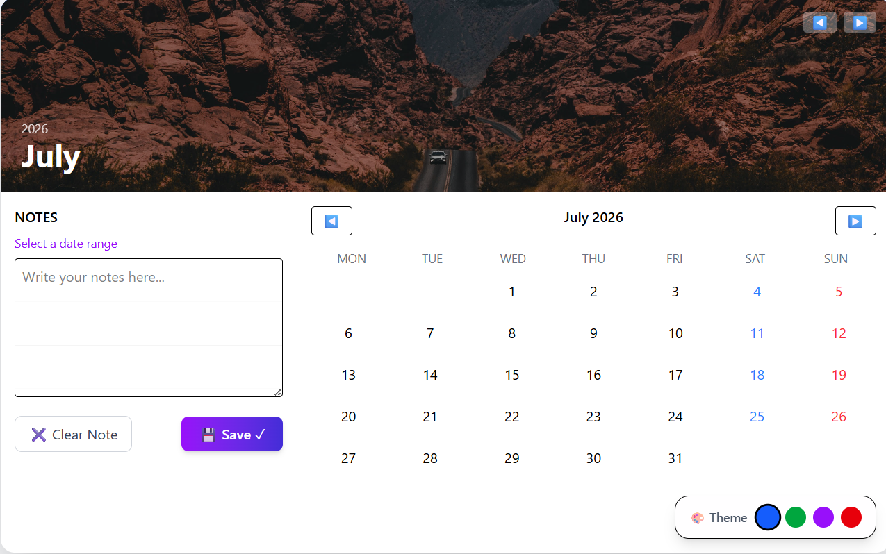
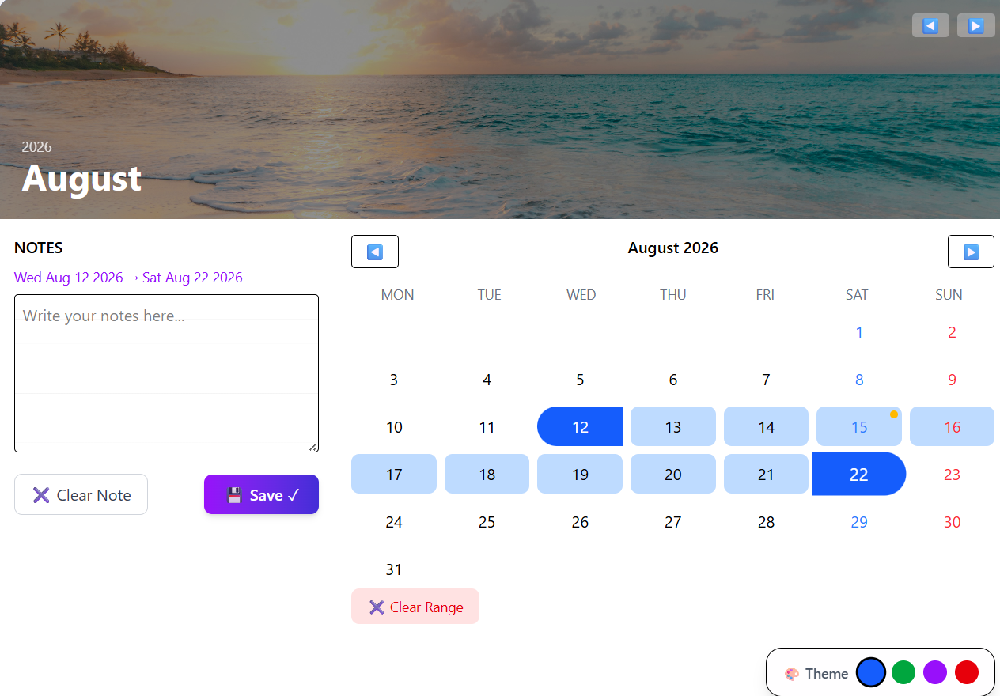

# 📅 Interactive Calendar Web App

A modern, visually rich calendar application built using **React + JavaScript**, designed with a focus on **user experience, animations, and customization**.

---

## ✨ Features

- 📅 Interactive calendar with date range selection
- 🎨 Theme switcher (Ocean Blue, Forest Green, Dusk Purple, Ember Red)
- 🖼️ Dynamic hero image (changes every month)
- 🪔 Indian holiday indicators (with tooltip)
- 🔵 Today indicator
- 📝 Notes system (save notes per date)
- 🟢 Note indicators (green dot on dates)
- 💾 LocalStorage persistence (notes saved after refresh)
- ✖ Clear selection & delete notes
- ⚡ Smooth animations using Framer Motion

---

## 🛠 Tech Stack

- React.js
- Tailwind CSS
- date-fns
- Framer Motion
- LocalStorage API

---

## 📂 Project Structure

```
src/
│── components/
│   ├── Calendar.jsx
│   ├── NotesPanel.jsx
│
│── App.jsx
│── main.jsx
```

---

## ⚙️ Installation & Setup

1. Clone the repository

```bash
git clone https://github.com/ayushi500/Interactive-calendar-component
```

2. Navigate to project folder

```bash
cd Client
```

3. Install dependencies

```bash
npm install
```

4. Run the app

```bash
npm run dev
```

---

## 🎯 Key Highlights

* Clean and modular React code
* Focus on UI/UX and real-world usability
* Interactive elements with visual feedback
* Customizable themes and dynamic content

---

## 💡 Future Improvements

* 💾 Save theme preference (localStorage)
* 📝 Add notes per day with persistence
* 📆 Add more holidays dynamically
* 🌐 Deploy live version

---

## 📸 Screenshots



---

## 🙋‍♀️ Author

**Ayushi Sharma**

* Passionate about frontend development & UI design
* Interested in building interactive web applications

---

## ⭐ If you like this project

Give it a ⭐ on GitHub!
